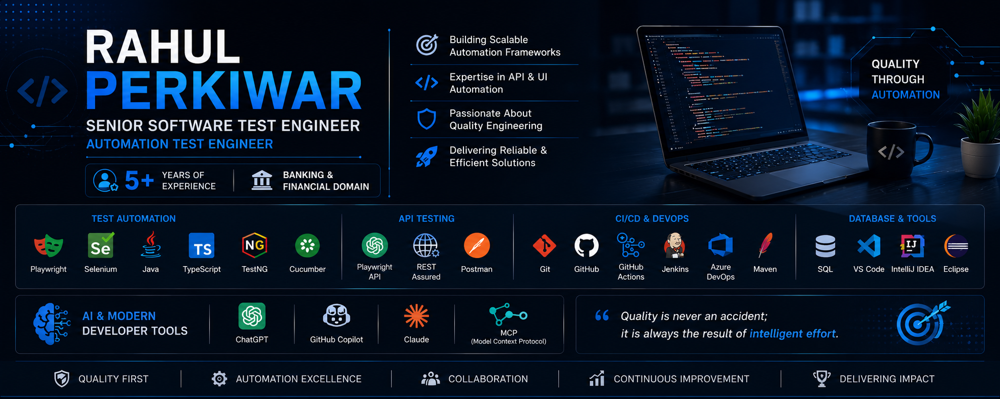

  

# Hi 👋, I'm Rahul Perkiwar

### Senior Software Test Engineer | Automation Test Engineer

---

## 👨‍💻 About Me

- 💼 Senior Software Test Engineer with **5+ Years of Experience**
- 🏦 Experienced in **Banking & Financial Services Domain**
- 🤖 Specialized in **UI & API Test Automation**
- 🎯 Strong experience in building **Playwright, Selenium, and Rest Assured Automation Frameworks**
- 🧪 Skilled in Functional, Regression, Smoke, Sanity, API, and Database Testing
- ⚡ Passionate about writing clean, scalable, and maintainable automation code
- 🌱 Currently exploring modern AI-assisted development tools such as **GitHub Copilot**, **ChatGPT**, **Claude**, and **MCP**

---

## 🚀 Tech Stack

### Programming Languages

- Java
- TypeScript

### Automation

- Playwright
- Selenium WebDriver
- REST Assured
- TestNG
- Cucumber (BDD)

### API Testing

- Playwright API
- REST Assured
- Postman

### CI/CD & Version Control

- Git
- GitHub
- GitHub Actions
- Jenkins
- Azure DevOps
- Maven

### Database

- SQL

### IDE & Tools

- Visual Studio Code
- Eclipse
- IntelliJ IDEA

---

## 🤖 AI & Modern Developer Tools

- ChatGPT
- GitHub Copilot
- Claude
- MCP (Model Context Protocol)

---

## 📂 Featured Project

### 🚀 Playwright API Automation Framework

Enterprise-grade API Automation Framework built using Playwright and TypeScript.

**Key Features**

- API Automation
- Reusable Framework Design
- Environment Configuration
- Test Data Management
- GitHub Actions Integration
- HTML Reporting

Repository:

👉 https://github.com/RahulPerkiwar/Playwright-API-Framework

---

## 📈 Currently Working On

- Enhancing Playwright API Automation Framework
- Building reusable automation utilities
- Exploring modern AI-assisted developer workflows

---

## 📫 Connect With Me

📧 Email

rahul.perkiwar20@gmail.com

💼 LinkedIn

https://www.linkedin.com/in/rahulperkiwar/

💻 GitHub

https://github.com/RahulPerkiwar

---

## 💡 Quote

> "Quality is never an accident; it is always the result of intelligent effort."

⭐ Thanks for visiting my GitHub Profile!
